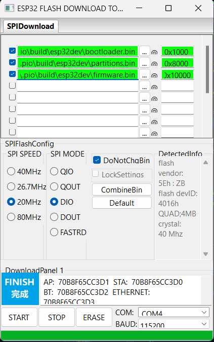

# ShiveWorks 
**ShiveWorks - a dynamic material research project at WPI**

* The purpose of this project is to create a device that demonstrates several concepts from the theory of dynamic materials. 
* ShiveWorks, the whole device, consists of a series of segments that can be actuated individually or in groups to create a variety of static or dynamic shapes. 
* The segments are connected to a central controller script that can be used to control the segments individually or in groups. 
* The controller can also be used to upload experiment parameters to the segments and to collect data from the segments during experiments. 
* ShiveWorks is intended to be used as a research tool to study the behavior and the potential applications of dynamic materials.

## Contributors
* Project Lead: @[William Sanguinet](https://github.com/williamsanguinet) | wcsanguinet@wpi.edu
* Engineer Lead: @[Jakub Jandus](https://github.com/BambusGS) | jjandus@wpi.edu

# Running an Experiment
* Generate actuation data by running GEN.py with appropriate parameters
  * Needs to be **run under Linux**
  * The script will generate many .csv files with the actuation data for each individual segment
  * The script should also plot of the actuation pattern
* Power on the router (has to have access to the internet)
  * Connect your PC
  * Start the MQTT broker server
* Run the overseer.py python script - issue commands by typing a command into the terminal
  * If first run, run the `clear_pairing` command for good measure
  * Pair all the modules, and upload the experiment parameters to the ESP32 modules/segments
    * Reference table below for light indicating segment status
  * Keep in mind that maximum payload size is 64kBytes and the maximum timestamp is 65 535 milliseconds
    * [This is because time is stored as a 16-bit unsigned integer in milliseconds]
  * After running the experiment the data will loop forever
* Segment should start to light up and the indicator light should blink green indicating it is ready
* Issue a "start" command that will begin a countdown sequence, the indicator light will become solid green for the duration of the experiment
* In case of an E-stop ("stop" command) or other fault, the indicator light will blink red

# How to get started:
## MQTT Broker Installation and Startup
* Download and install the latest [mosquitto MQTT broker](https://mosquitto.org/download/)
* Linux
  * Run `mosquitto -v --config-file {{path/to/mosquitto.conf}}` to start the broker
* Windows
  * Go to the mosquitto installation directory (`cd C:\Program Files\mosquitto`), open terminal and run `mosquitto -v --config-file {{path/to/mosquitto.conf}}` to start the broker
  * Make sure the network is set to "Private" in the Windows Firewall settings
  * An [MQTT Explorer](https://mqtt-explorer.com/) is recommended to monitor the MQTT messages

## Network Configuration
* Connect your computer to the same WiFi network as the ESP32 modules, the network should have access to the outside internet for NTP synchronization
* Configure your machine to have a static IP address on the same network as the ESP32 modules (using Windows Network and Sharing Center)
  * Set the network type as private
  * The default IP address your PC (= MQTT server) is 192.168.1.1; this should be outside the dynamic DHCP range of the router
    * Subnet mask is 255.255.254.0, gateway is 192.168.1.0, primary DNS is 192.168.1.0
* The overseer.py script will automatically connect to the MQTT broker, as they are usually running on the same machine
  
## Overseer.py Main Control Script
  * Download and install [paho](https://pypi.org/project/paho-mqtt/) python library
  * The overseer script is used as a main translator between the simulation and the segments
  * It is command line based, and any command that is typed in will be sent to the segments accordingly

| Command             | Action                                                               |
| ------------------- | -------------------------------------------------------------------- |
| start               | Starts the countdown of 3 seconds                                    |
| stop                | Halts the experiment immediately                                     |
| ~~reset~~           | ~~Resets all segments to pre-experiment stage~~                      |
| restart             | Restarts all segments, same as holding down the physical button      |
| upload              | Uploads the experiment parameters to all segments individually       |
| ~~timesync~~        | ~~Syncs the time of the segments with NTP, syncs overseer with NTP~~ |
| clear_pairing       | Clears the pairing of segments                                       |
| debug               | Writes script debug info                                             |
| move -p 127         | Move all segments to position the middle (127)                       |
| exit                | Exits the script                                                     |
| assign -s 42        | Assigns any currently available segments to position 42              |
| restart -s 42       | Restarts segment 42, same as holding down the physical button        |
| upload -s 42        | Uploads the experiment parameters to segment 42                      |
| ~~timesync -s 42~~  | ~~Syncs the time of segment 42 with NTP~~                            |
| clear_pairing -s 42 | Clears the pairing of segment 42                                     |
| debug -s 42         | Writes script debug info for segment number 42                       |
| move -s 42 -p 255   | Move segment 42 to position max position (255)                       |
|                     |                                                                      |

* General MQTT command string message format is `{{command}}::{{data}}` 

<!-- implement a segment servo offset function -->

# Experiment Setup
## Segment Power Up and Pairing
* Power up the segment - upon initialization the indicator light should light up blue
* ESP32 will connect to the local MQTT broker - upon connection the indicator light should blink blue
  * If the segment is unable to connect to the MQTT broker, the indicator light will turn blinking red indicating a fault
* Once connected to the MQTT broker, the segment will automatically subscribe to the topic `ShiveWorks/overseer/command`
  * This is an equivalent to a command line that all segments will listen to
  * Servo is limited in main.cpp to min and max angle in degrees
  * The **input movement range for the segment is then 0 to 255** (an 8-bit unsigned integer number)
    * Ex.: if limited to 45 to 135 degrees of movement, a command of '0' will move the servo to 45 degrees, and a command of '255' will move the servo to 135 degrees
* For newly flashed segments, the sequence number will have to be assigned
  * Press the button on the segment to initiate the segment number assignment - the indicator light should start blink purple
  * By typing `assign -s 42` into the python script command line and sending that to the overseer topic, the segment will be assigned to position 42
  * Indicator light will turn purple solid to indicate the segment number has been received and saved
* Each segment will then subscribe to the topic `ShiveWorks/segment/ID` where ID represents a unique ID for each segment is the sequence number of the segment
  * This is topic with transmit (`/return`), command (`/command`), obtain actuation data (`/data`) and status (`/status`) channels for to the specific segment
  * Longest command shall be 128 bytes long
  * Experiment data is stored separately from the message, maximum size is 64kB
    * Timestamps are stored as 16-bit unsigned integers, so the number shall be between 0 and 65535 only
    * Actuation value is an 8-bit unsigned integer, so the number shall be between 0 and 255 only
      * with the exception that a .csv value of -100 means skip this actuation line
    * The csv file generated for the *first* segment shall be named `1.csv` and formatted with `timestamp, value` format - e.g. `1000,255` on each line, other segments shall follow this format

 
| Segment Status           | LED Indicator Light |
| ------------------------ | ------------------- |
| Initializing Hardware    | White Solid         |
| Connected to Wifi        | Blue Solid          |
| Connected to MQTT Broker | Blue Blinking       |
| Segment Position Pairing | Purple Blinking     |
| Segment Position Paired  | Purple Solid        |
| Downloading Experiment   | Yellow Blinking     |
| Ready for Experiment     | Green Blinking      |
| Experiment Running       | Green Solid         |
| E-Stop                   | Red Solid           |
| Fault                    | Dark Red Blinking   |
|                          |                     |

| Button Press      | Action                               |
| ----------------- | ------------------------------------ |
| Button Tap        | Initiate Segment Position Assignment |
| Button Double Tap | Segment Self-Test                    |
| Button 2s+ hold   | Restart Segment                      |
|                   |                                      |

## ESP32 Segment Code Upload
* Segments are numbered starting from 1 to 100
* All source files are in WaveSegment folder, in the 'src' directory
* Enter correct local WiFi credential and MQTT broker IP address in credentials.h (rename and fill out sample_credentials.h)
* Compile and upload main.c to the ESP32
  * Connect the ESP32 with disconnected battery power to your PC using a micro-USB cable one at a time
  * Might require installation of [ESP32 drivers](https://docs.espressif.com/projects/esp-idf/en/latest/esp32/get-started/establish-serial-connection.html)
  * If we want to see diagnostic information, we can use the Serial Monitor in the Arduino IDE with a baud rate of 115200
* The latest version of the pre-compiled firmware binary can be found under releases
  * Use the [ESPRESSIF Flash Tool](https://www.espressif.com/en/support/download/other-tools) to flash the .bin file to the ESP32
    * Click the three dots button and select the firmware.bin file
    * Set a memory offset of 0x10000, and click START to start the upload
    * Select a COM port (try multiple if it does not upload), SPI speed of 20MHz, DIO mode, and a BAUD rate of 115200
  * Connect the ESP32 with disconnected battery power to your PC using a micro-USB cable one at a time
  
    

<!-- * Once the initial sketch has been uploaded through USB, for subsequent uploads an OTA method can be used
  * Compile and upload main.c to the ESP32
  * Run `python3 OTA.py` to upload the sketch to the ESP32 over WiFi -->

## ESP32 Segment Circuit

### Component List
* ESP32 DevKitV1
* MPU6050 Accelerometer/Gyroscope
* WS2812B RGB LED 2x
* MG90D Servo 2x
* Logic Level Converter 3.3V to 5V
* Voltage Regulator to 5V
* Push Button
* LiPo Battery 3.7V 800mAh 2x